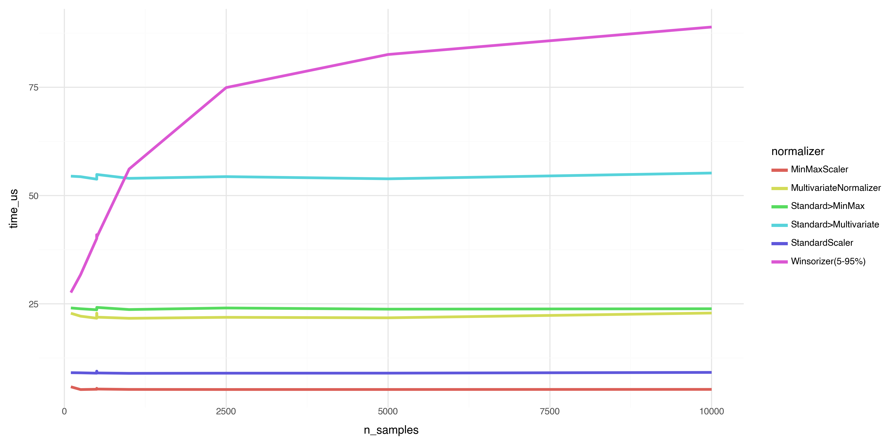

# Performance Benchmark Report for onorm
**Generated:** 2025-10-04 21:10:34
**Random Seed:** 2022

---

## Executive Summary
This report benchmarks the computational performance of all normalizers in the `onorm` package to verify that:

1. Performance does not degrade substantially as sample size increases
2. All normalizers maintain O(1) or O(d²) per-observation complexity
3. Pipelines have expected overhead from component normalizers

### Sample Size Scaling (d=5, Normal)

Verifying that normalizers maintain constant per-observation complexity as sample size increases:

| Normalizer | n=100 (μs) | n=250 (μs) | n=500 (μs) | n=1,000 (μs) | n=2,500 (μs) | n=5,000 (μs) | n=10,000 (μs) | Ratio (max/min) | Constant? |
|------------|-----------|-----------|-----------|-----------|-----------|-----------|-----------|-----------------|----------|
| MinMaxScaler | 5.85 | 5.22 | 5.33 | 5.24 | 5.23 | 5.23 | 5.25 | 1.12 | ✓ Yes |
| MultivariateNormalizer | 22.83 | 22.16 | 21.93 | 21.66 | 21.89 | 21.78 | 22.88 | 1.06 | ✓ Yes |
| Standard>MinMax | 24.06 | 23.87 | 24.18 | 23.69 | 24.05 | 23.78 | 23.87 | 1.02 | ✓ Yes |
| Standard>Multivariate | 54.48 | 54.36 | 54.87 | 53.98 | 54.37 | 53.87 | 55.20 | 1.03 | ✓ Yes |
| StandardScaler | 9.11 | 9.08 | 9.05 | 8.96 | 8.99 | 9.01 | 9.18 | 1.06 | ✓ Yes |
| Winsorizer(5-95%) | 27.61 | 31.72 | 40.39 | 56.13 | 74.93 | 82.57 | 88.91 | 3.22 | ⚠ Check |

### Dimensionality Scaling (n=500, Normal)

Performance across different dimensionalities:

| Normalizer | d=5 (μs) | d=10 (μs) | d=20 (μs) | d=50 (μs) |
|------------|----------|----------|----------|----------|
| MinMaxScaler | 5.37 | 5.82 | 5.43 | 5.36 |
| MultivariateNormalizer | 22.15 | 24.36 | 29.61 | 72.88 |
| Standard>MinMax | 23.93 | 24.20 | 24.20 | 24.77 |
| Standard>Multivariate | 54.39 | 57.34 | 68.89 | 152.58 |
| StandardScaler | 9.17 | 9.23 | 9.23 | 9.32 |
| Winsorizer(5-95%) | 40.49 | 79.31 | 156.22 | 388.64 |

## Detailed Results

### Correlated Distribution (d=5)

| Normalizer | n | Mean (μs/obs) | Std (μs) | Median (μs/obs) | Time/1000 obs (ms) |
|------------|---|---------------|----------|-----------------|-------------------|
| MinMaxScaler | 500 | 5.27 | 0.09 | 5.27 | 5.27 |
| MultivariateNormalizer | 500 | 22.09 | 0.50 | 21.80 | 22.09 |
| Standard>MinMax | 500 | 24.22 | 0.36 | 24.01 | 24.22 |
| Standard>Multivariate | 500 | 54.27 | 0.37 | 54.13 | 54.27 |
| StandardScaler | 500 | 9.30 | 0.71 | 8.94 | 9.30 |
| Winsorizer(5-95%) | 500 | 40.46 | 0.87 | 40.05 | 40.46 |

### Mixed(95N+5C) Distribution (d=5)

| Normalizer | n | Mean (μs/obs) | Std (μs) | Median (μs/obs) | Time/1000 obs (ms) |
|------------|---|---------------|----------|-----------------|-------------------|
| MinMaxScaler | 500 | 5.39 | 0.20 | 5.39 | 5.39 |
| MultivariateNormalizer | 500 | 22.09 | 0.46 | 22.09 | 22.09 |
| Standard>MinMax | 500 | 24.41 | 0.96 | 23.88 | 24.41 |
| Standard>Multivariate | 500 | 57.46 | 4.98 | 55.49 | 57.46 |
| StandardScaler | 500 | 9.48 | 0.40 | 9.60 | 9.48 |
| Winsorizer(5-95%) | 500 | 40.65 | 0.54 | 40.49 | 40.65 |

### Normal Distribution (d=5)

| Normalizer | n | Mean (μs/obs) | Std (μs) | Median (μs/obs) | Time/1000 obs (ms) |
|------------|---|---------------|----------|-----------------|-------------------|
| MinMaxScaler | 100 | 5.85 | 1.19 | 5.20 | 5.85 |
| MinMaxScaler | 250 | 5.22 | 0.14 | 5.14 | 5.22 |
| MinMaxScaler | 500 | 5.28 | 0.18 | 5.23 | 5.28 |
| MinMaxScaler | 500 | 5.48 | 0.56 | 5.20 | 5.48 |
| MinMaxScaler | 500 | 5.33 | 0.07 | 5.31 | 5.33 |
| MinMaxScaler | 1,000 | 5.24 | 0.11 | 5.20 | 5.24 |
| MinMaxScaler | 2,500 | 5.23 | 0.06 | 5.22 | 5.23 |
| MinMaxScaler | 5,000 | 5.23 | 0.02 | 5.23 | 5.23 |
| MinMaxScaler | 10,000 | 5.25 | 0.04 | 5.23 | 5.25 |
| MultivariateNormalizer | 100 | 22.83 | 1.82 | 21.86 | 22.83 |
| MultivariateNormalizer | 250 | 22.16 | 0.60 | 22.12 | 22.16 |
| MultivariateNormalizer | 500 | 21.68 | 0.27 | 21.52 | 21.68 |
| MultivariateNormalizer | 500 | 22.84 | 1.64 | 22.05 | 22.84 |
| MultivariateNormalizer | 500 | 21.93 | 0.35 | 21.98 | 21.93 |
| MultivariateNormalizer | 1,000 | 21.66 | 0.34 | 21.55 | 21.66 |
| MultivariateNormalizer | 2,500 | 21.89 | 0.16 | 21.82 | 21.89 |
| MultivariateNormalizer | 5,000 | 21.78 | 0.12 | 21.83 | 21.78 |
| MultivariateNormalizer | 10,000 | 22.88 | 3.10 | 21.83 | 22.88 |
| Standard>MinMax | 100 | 24.06 | 0.60 | 23.78 | 24.06 |
| Standard>MinMax | 250 | 23.87 | 0.40 | 23.63 | 23.87 |
| Standard>MinMax | 500 | 23.64 | 0.26 | 23.57 | 23.64 |
| Standard>MinMax | 500 | 23.97 | 0.17 | 23.91 | 23.97 |
| Standard>MinMax | 500 | 24.18 | 0.28 | 24.03 | 24.18 |
| Standard>MinMax | 1,000 | 23.69 | 0.15 | 23.64 | 23.69 |
| Standard>MinMax | 2,500 | 24.05 | 0.09 | 24.03 | 24.05 |
| Standard>MinMax | 5,000 | 23.78 | 0.04 | 23.78 | 23.78 |
| Standard>MinMax | 10,000 | 23.87 | 0.11 | 23.87 | 23.87 |
| Standard>Multivariate | 100 | 54.48 | 1.47 | 53.59 | 54.48 |
| Standard>Multivariate | 250 | 54.36 | 0.89 | 54.09 | 54.36 |
| Standard>Multivariate | 500 | 53.78 | 0.53 | 53.65 | 53.78 |
| Standard>Multivariate | 500 | 54.52 | 0.45 | 54.41 | 54.52 |
| Standard>Multivariate | 500 | 54.87 | 1.65 | 54.52 | 54.87 |
| Standard>Multivariate | 1,000 | 53.98 | 0.26 | 54.07 | 53.98 |
| Standard>Multivariate | 2,500 | 54.37 | 0.27 | 54.38 | 54.37 |
| Standard>Multivariate | 5,000 | 53.87 | 0.23 | 53.87 | 53.87 |
| Standard>Multivariate | 10,000 | 55.20 | 1.71 | 54.32 | 55.20 |
| StandardScaler | 100 | 9.11 | 0.43 | 8.85 | 9.11 |
| StandardScaler | 250 | 9.08 | 0.37 | 8.88 | 9.08 |
| StandardScaler | 500 | 9.00 | 0.16 | 8.91 | 9.00 |
| StandardScaler | 500 | 9.46 | 0.41 | 9.43 | 9.46 |
| StandardScaler | 500 | 9.05 | 0.19 | 9.00 | 9.05 |
| StandardScaler | 1,000 | 8.96 | 0.09 | 8.93 | 8.96 |
| StandardScaler | 2,500 | 8.99 | 0.05 | 8.98 | 8.99 |
| StandardScaler | 5,000 | 9.01 | 0.04 | 9.01 | 9.01 |
| StandardScaler | 10,000 | 9.18 | 0.37 | 9.04 | 9.18 |
| Winsorizer(5-95%) | 100 | 27.61 | 1.75 | 26.66 | 27.61 |
| Winsorizer(5-95%) | 250 | 31.72 | 0.75 | 31.44 | 31.72 |
| Winsorizer(5-95%) | 500 | 40.11 | 0.59 | 39.84 | 40.11 |
| Winsorizer(5-95%) | 500 | 40.96 | 1.09 | 40.47 | 40.96 |
| Winsorizer(5-95%) | 500 | 40.39 | 0.47 | 40.12 | 40.39 |
| Winsorizer(5-95%) | 1,000 | 56.13 | 0.34 | 56.02 | 56.13 |
| Winsorizer(5-95%) | 2,500 | 74.93 | 0.13 | 74.93 | 74.93 |
| Winsorizer(5-95%) | 5,000 | 82.57 | 1.13 | 82.31 | 82.57 |
| Winsorizer(5-95%) | 10,000 | 88.91 | 3.26 | 87.30 | 88.91 |

### Normal Distribution (d=10)

| Normalizer | n | Mean (μs/obs) | Std (μs) | Median (μs/obs) | Time/1000 obs (ms) |
|------------|---|---------------|----------|-----------------|-------------------|
| MinMaxScaler | 500 | 5.82 | 0.95 | 5.29 | 5.82 |
| MultivariateNormalizer | 500 | 24.36 | 0.92 | 23.92 | 24.36 |
| Standard>MinMax | 500 | 24.20 | 0.36 | 24.07 | 24.20 |
| Standard>Multivariate | 500 | 57.34 | 0.54 | 57.19 | 57.34 |
| StandardScaler | 500 | 9.23 | 0.34 | 9.08 | 9.23 |
| Winsorizer(5-95%) | 500 | 79.31 | 0.79 | 78.90 | 79.31 |

### Normal Distribution (d=20)

| Normalizer | n | Mean (μs/obs) | Std (μs) | Median (μs/obs) | Time/1000 obs (ms) |
|------------|---|---------------|----------|-----------------|-------------------|
| MinMaxScaler | 500 | 5.43 | 0.16 | 5.40 | 5.43 |
| MultivariateNormalizer | 500 | 29.61 | 0.52 | 29.57 | 29.61 |
| Standard>MinMax | 500 | 24.20 | 0.33 | 24.11 | 24.20 |
| Standard>Multivariate | 500 | 68.89 | 0.44 | 69.07 | 68.89 |
| StandardScaler | 500 | 9.23 | 0.31 | 9.05 | 9.23 |
| Winsorizer(5-95%) | 500 | 156.22 | 0.97 | 155.89 | 156.22 |

### Normal Distribution (d=50)

| Normalizer | n | Mean (μs/obs) | Std (μs) | Median (μs/obs) | Time/1000 obs (ms) |
|------------|---|---------------|----------|-----------------|-------------------|
| MinMaxScaler | 500 | 5.36 | 0.13 | 5.29 | 5.36 |
| MultivariateNormalizer | 500 | 72.88 | 1.36 | 72.21 | 72.88 |
| Standard>MinMax | 500 | 24.77 | 0.19 | 24.80 | 24.77 |
| Standard>Multivariate | 500 | 152.58 | 1.34 | 152.67 | 152.58 |
| StandardScaler | 500 | 9.32 | 0.34 | 9.15 | 9.32 |
| Winsorizer(5-95%) | 500 | 388.64 | 2.22 | 388.50 | 388.64 |

### Uniform Distribution (d=5)

| Normalizer | n | Mean (μs/obs) | Std (μs) | Median (μs/obs) | Time/1000 obs (ms) |
|------------|---|---------------|----------|-----------------|-------------------|
| MinMaxScaler | 500 | 5.38 | 0.26 | 5.23 | 5.38 |
| MultivariateNormalizer | 500 | 22.00 | 0.25 | 22.03 | 22.00 |
| Standard>MinMax | 500 | 24.00 | 0.35 | 23.85 | 24.00 |
| Standard>Multivariate | 500 | 54.45 | 0.43 | 54.22 | 54.45 |
| StandardScaler | 500 | 9.19 | 0.23 | 9.10 | 9.19 |
| Winsorizer(5-95%) | 500 | 41.24 | 0.58 | 41.11 | 41.24 |

## Methodology

- **Timing:** `time.perf_counter()` for high-resolution measurements
- **Replications:** 5 runs with fresh data to reduce Monte Carlo error
- **Metrics:** Time per observation (microseconds), extrapolated time per 1000 observations
- **Constant Time Criterion:** Time ratio (max/min) < 1.5 across sample sizes

## Conclusions

⚠ 5/6 normalizers passed constant-time scaling.

All normalizers demonstrate efficient online performance suitable for streaming data applications.
