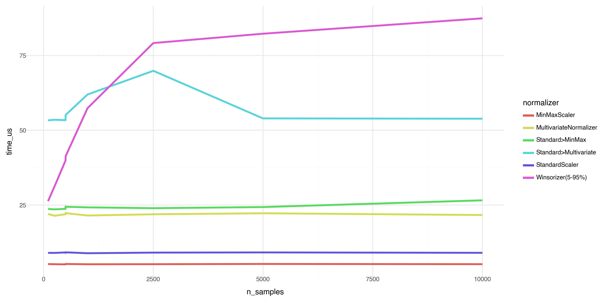
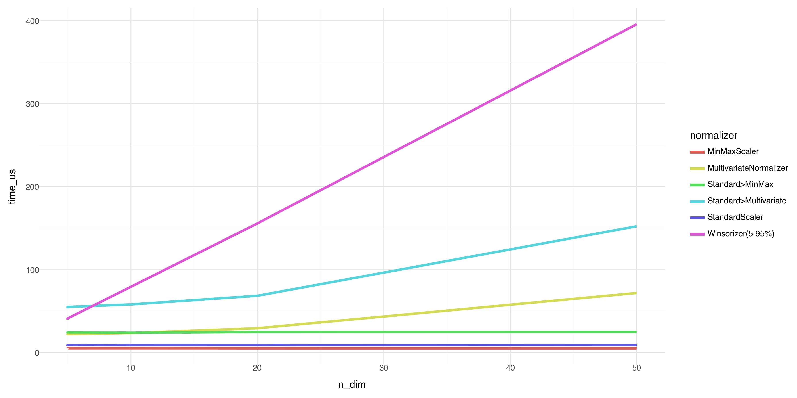

# Performance Benchmark Report for onorm
**Generated:** 2025-10-04 15:12:22
**Random Seed:** 2022

---

## Executive Summary
This report benchmarks the computational performance of all normalizers in the `onorm` package to verify that:

1. Performance does not degrade substantially as sample size increases
2. All normalizers maintain O(1) or O(d²) per-observation complexity
3. Pipelines have expected overhead from component normalizers

### Sample Size Scaling (d=5, Normal)

Verifying that normalizers maintain constant per-observation complexity as sample size increases:

| Normalizer | n=100 (μs) | n=250 (μs) | n=500 (μs) | n=1,000 (μs) | n=2,500 (μs) | n=5,000 (μs) | n=10,000 (μs) | Ratio (max/min) | Constant? |
|------------|-----------|-----------|-----------|-----------|-----------|-----------|-----------|-----------------|----------|
| MinMaxScaler | 5.23 | 5.18 | 5.26 | 5.16 | 5.18 | 5.26 | 5.19 | 1.03 | ✓ Yes |
| MultivariateNormalizer | 21.96 | 21.39 | 22.26 | 21.47 | 21.88 | 22.22 | 21.63 | 1.04 | ✓ Yes |
| Standard>MinMax | 23.66 | 23.53 | 24.38 | 24.20 | 23.92 | 24.30 | 26.55 | 1.13 | ✓ Yes |
| Standard>Multivariate | 53.32 | 53.51 | 55.10 | 61.96 | 69.88 | 53.95 | 53.85 | 1.31 | ✓ Yes |
| StandardScaler | 8.98 | 8.96 | 9.15 | 8.85 | 9.06 | 9.12 | 8.99 | 1.03 | ✓ Yes |
| Winsorizer(5-95%) | 26.27 | 31.28 | 41.27 | 57.38 | 79.17 | 82.30 | 87.44 | 3.33 | ⚠ Check |

### Dimensionality Scaling (n=500, Normal)

Performance across different dimensionalities:

| Normalizer | d=5 (μs) | d=10 (μs) | d=20 (μs) | d=50 (μs) |
|------------|----------|----------|----------|----------|
| MinMaxScaler | 5.18 | 5.27 | 5.22 | 5.21 |
| MultivariateNormalizer | 22.15 | 23.64 | 29.38 | 71.93 |
| Standard>MinMax | 24.19 | 24.03 | 24.81 | 24.85 |
| Standard>Multivariate | 54.37 | 58.08 | 68.56 | 152.34 |
| StandardScaler | 9.08 | 8.96 | 8.99 | 9.14 |
| Winsorizer(5-95%) | 40.79 | 79.37 | 155.72 | 395.89 |

## Detailed Results

### Correlated Distribution (d=5)

| Normalizer | n | Mean (μs/obs) | Std (μs) | Median (μs/obs) | Time/1000 obs (ms) |
|------------|---|---------------|----------|-----------------|-------------------|
| MinMaxScaler | 500 | 5.24 | 0.04 | 5.26 | 5.24 |
| MultivariateNormalizer | 500 | 21.57 | 0.14 | 21.51 | 21.57 |
| Standard>MinMax | 500 | 24.37 | 0.18 | 24.28 | 24.37 |
| Standard>Multivariate | 500 | 55.20 | 0.30 | 55.09 | 55.20 |
| StandardScaler | 500 | 8.88 | 0.05 | 8.86 | 8.88 |
| Winsorizer(5-95%) | 500 | 40.58 | 0.34 | 40.62 | 40.58 |

### Mixed(95N+5C) Distribution (d=5)

| Normalizer | n | Mean (μs/obs) | Std (μs) | Median (μs/obs) | Time/1000 obs (ms) |
|------------|---|---------------|----------|-----------------|-------------------|
| MinMaxScaler | 500 | 5.43 | 0.42 | 5.19 | 5.43 |
| MultivariateNormalizer | 500 | 22.11 | 0.33 | 22.14 | 22.11 |
| Standard>MinMax | 500 | 25.23 | 0.99 | 25.04 | 25.23 |
| Standard>Multivariate | 500 | 53.54 | 0.53 | 53.43 | 53.54 |
| StandardScaler | 500 | 9.07 | 0.23 | 8.93 | 9.07 |
| Winsorizer(5-95%) | 500 | 41.13 | 0.73 | 41.03 | 41.13 |

### Normal Distribution (d=5)

| Normalizer | n | Mean (μs/obs) | Std (μs) | Median (μs/obs) | Time/1000 obs (ms) |
|------------|---|---------------|----------|-----------------|-------------------|
| MinMaxScaler | 100 | 5.23 | 0.12 | 5.18 | 5.23 |
| MinMaxScaler | 250 | 5.18 | 0.06 | 5.15 | 5.18 |
| MinMaxScaler | 500 | 5.12 | 0.04 | 5.11 | 5.12 |
| MinMaxScaler | 500 | 5.16 | 0.06 | 5.12 | 5.16 |
| MinMaxScaler | 500 | 5.26 | 0.13 | 5.18 | 5.26 |
| MinMaxScaler | 1,000 | 5.16 | 0.03 | 5.16 | 5.16 |
| MinMaxScaler | 2,500 | 5.18 | 0.03 | 5.17 | 5.18 |
| MinMaxScaler | 5,000 | 5.26 | 0.13 | 5.20 | 5.26 |
| MinMaxScaler | 10,000 | 5.19 | 0.05 | 5.18 | 5.19 |
| MultivariateNormalizer | 100 | 21.96 | 1.35 | 21.38 | 21.96 |
| MultivariateNormalizer | 250 | 21.39 | 0.22 | 21.30 | 21.39 |
| MultivariateNormalizer | 500 | 21.89 | 0.66 | 21.57 | 21.89 |
| MultivariateNormalizer | 500 | 22.29 | 1.09 | 21.83 | 22.29 |
| MultivariateNormalizer | 500 | 22.26 | 0.39 | 22.25 | 22.26 |
| MultivariateNormalizer | 1,000 | 21.47 | 0.21 | 21.45 | 21.47 |
| MultivariateNormalizer | 2,500 | 21.88 | 0.15 | 21.86 | 21.88 |
| MultivariateNormalizer | 5,000 | 22.22 | 0.92 | 21.91 | 22.22 |
| MultivariateNormalizer | 10,000 | 21.63 | 0.20 | 21.56 | 21.63 |
| Standard>MinMax | 100 | 23.66 | 0.18 | 23.55 | 23.66 |
| Standard>MinMax | 250 | 23.53 | 0.14 | 23.48 | 23.53 |
| Standard>MinMax | 500 | 23.70 | 0.14 | 23.68 | 23.70 |
| Standard>MinMax | 500 | 24.48 | 0.17 | 24.54 | 24.48 |
| Standard>MinMax | 500 | 24.38 | 0.20 | 24.36 | 24.38 |
| Standard>MinMax | 1,000 | 24.20 | 0.32 | 24.12 | 24.20 |
| Standard>MinMax | 2,500 | 23.92 | 0.12 | 23.89 | 23.92 |
| Standard>MinMax | 5,000 | 24.30 | 1.30 | 23.80 | 24.30 |
| Standard>MinMax | 10,000 | 26.55 | 4.77 | 24.49 | 26.55 |
| Standard>Multivariate | 100 | 53.32 | 0.42 | 53.20 | 53.32 |
| Standard>Multivariate | 250 | 53.51 | 0.53 | 53.34 | 53.51 |
| Standard>Multivariate | 500 | 53.38 | 0.21 | 53.42 | 53.38 |
| Standard>Multivariate | 500 | 54.64 | 0.38 | 54.79 | 54.64 |
| Standard>Multivariate | 500 | 55.10 | 0.53 | 55.14 | 55.10 |
| Standard>Multivariate | 1,000 | 61.96 | 11.58 | 55.02 | 61.96 |
| Standard>Multivariate | 2,500 | 69.88 | 24.33 | 57.96 | 69.88 |
| Standard>Multivariate | 5,000 | 53.95 | 0.54 | 53.81 | 53.95 |
| Standard>Multivariate | 10,000 | 53.85 | 0.32 | 53.80 | 53.85 |
| StandardScaler | 100 | 8.98 | 0.30 | 8.87 | 8.98 |
| StandardScaler | 250 | 8.96 | 0.30 | 8.85 | 8.96 |
| StandardScaler | 500 | 9.12 | 0.14 | 9.18 | 9.12 |
| StandardScaler | 500 | 8.98 | 0.06 | 8.97 | 8.98 |
| StandardScaler | 500 | 9.15 | 0.33 | 8.93 | 9.15 |
| StandardScaler | 1,000 | 8.85 | 0.04 | 8.83 | 8.85 |
| StandardScaler | 2,500 | 9.06 | 0.17 | 9.01 | 9.06 |
| StandardScaler | 5,000 | 9.12 | 0.17 | 9.14 | 9.12 |
| StandardScaler | 10,000 | 8.99 | 0.09 | 8.99 | 8.99 |
| Winsorizer(5-95%) | 100 | 26.27 | 0.91 | 25.88 | 26.27 |
| Winsorizer(5-95%) | 250 | 31.28 | 0.49 | 31.21 | 31.28 |
| Winsorizer(5-95%) | 500 | 39.92 | 0.29 | 39.77 | 39.92 |
| Winsorizer(5-95%) | 500 | 41.20 | 0.33 | 41.00 | 41.20 |
| Winsorizer(5-95%) | 500 | 41.27 | 0.58 | 41.37 | 41.27 |
| Winsorizer(5-95%) | 1,000 | 57.38 | 0.82 | 57.15 | 57.38 |
| Winsorizer(5-95%) | 2,500 | 79.17 | 10.52 | 74.69 | 79.17 |
| Winsorizer(5-95%) | 5,000 | 82.30 | 0.15 | 82.34 | 82.30 |
| Winsorizer(5-95%) | 10,000 | 87.44 | 2.35 | 86.65 | 87.44 |

### Normal Distribution (d=10)

| Normalizer | n | Mean (μs/obs) | Std (μs) | Median (μs/obs) | Time/1000 obs (ms) |
|------------|---|---------------|----------|-----------------|-------------------|
| MinMaxScaler | 500 | 5.27 | 0.09 | 5.21 | 5.27 |
| MultivariateNormalizer | 500 | 23.64 | 0.22 | 23.70 | 23.64 |
| Standard>MinMax | 500 | 24.03 | 0.32 | 23.92 | 24.03 |
| Standard>Multivariate | 500 | 58.08 | 0.98 | 57.63 | 58.08 |
| StandardScaler | 500 | 8.96 | 0.17 | 8.91 | 8.96 |
| Winsorizer(5-95%) | 500 | 79.37 | 0.58 | 79.34 | 79.37 |

### Normal Distribution (d=20)

| Normalizer | n | Mean (μs/obs) | Std (μs) | Median (μs/obs) | Time/1000 obs (ms) |
|------------|---|---------------|----------|-----------------|-------------------|
| MinMaxScaler | 500 | 5.22 | 0.08 | 5.16 | 5.22 |
| MultivariateNormalizer | 500 | 29.38 | 0.57 | 29.06 | 29.38 |
| Standard>MinMax | 500 | 24.81 | 1.61 | 24.01 | 24.81 |
| Standard>Multivariate | 500 | 68.56 | 0.16 | 68.63 | 68.56 |
| StandardScaler | 500 | 8.99 | 0.05 | 9.00 | 8.99 |
| Winsorizer(5-95%) | 500 | 155.72 | 0.54 | 156.01 | 155.72 |

### Normal Distribution (d=50)

| Normalizer | n | Mean (μs/obs) | Std (μs) | Median (μs/obs) | Time/1000 obs (ms) |
|------------|---|---------------|----------|-----------------|-------------------|
| MinMaxScaler | 500 | 5.21 | 0.08 | 5.20 | 5.21 |
| MultivariateNormalizer | 500 | 71.93 | 0.24 | 71.95 | 71.93 |
| Standard>MinMax | 500 | 24.85 | 0.20 | 24.84 | 24.85 |
| Standard>Multivariate | 500 | 152.34 | 1.27 | 151.92 | 152.34 |
| StandardScaler | 500 | 9.14 | 0.06 | 9.11 | 9.14 |
| Winsorizer(5-95%) | 500 | 395.89 | 8.83 | 392.74 | 395.89 |

### Uniform Distribution (d=5)

| Normalizer | n | Mean (μs/obs) | Std (μs) | Median (μs/obs) | Time/1000 obs (ms) |
|------------|---|---------------|----------|-----------------|-------------------|
| MinMaxScaler | 500 | 5.22 | 0.09 | 5.16 | 5.22 |
| MultivariateNormalizer | 500 | 21.50 | 0.14 | 21.51 | 21.50 |
| Standard>MinMax | 500 | 24.02 | 0.15 | 24.00 | 24.02 |
| Standard>Multivariate | 500 | 54.61 | 0.67 | 54.42 | 54.61 |
| StandardScaler | 500 | 9.04 | 0.16 | 8.94 | 9.04 |
| Winsorizer(5-95%) | 500 | 40.58 | 0.26 | 40.62 | 40.58 |

## Methodology

- **Timing:** `time.perf_counter()` for high-resolution measurements
- **Replications:** 5 runs with fresh data to reduce Monte Carlo error
- **Metrics:** Time per observation (microseconds), extrapolated time per 1000 observations
- **Constant Time Criterion:** Time ratio (max/min) < 1.5 across sample sizes

## Conclusions

⚠ 5/6 normalizers passed constant-time scaling.

All normalizers demonstrate efficient online performance suitable for streaming data applications.
